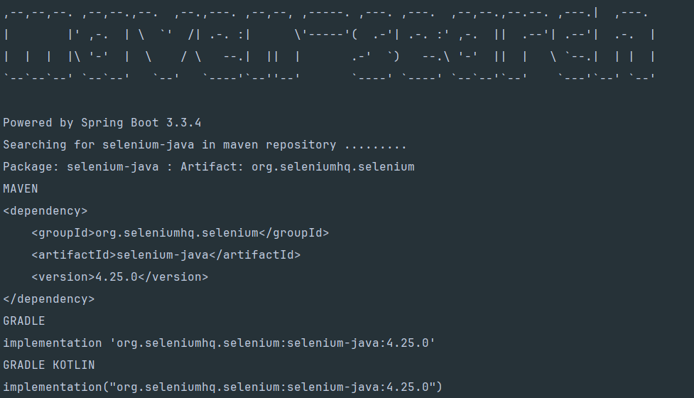

<h1 align="center" style="font-weight: bold;">Maven Search 🔍</h1>

<p align="center">
 <a href="#tech">Technologies</a> • 
 <a href="#started">Getting Started</a> •
 <a href="#example">Example Usage</a> •
 <a href="#colab">Collaborators</a> •
 <a href="#contribute">Contribute</a>
</p>

<p align="center">
    <b>This project is a Spring application written in Kotlin. 
It uses Gradle as the build tool. 
The application automates access to a Maven repository to search for dependencies using Spring Shell.
</b>
</p>

<h2 id="technologies">💻 Technologies</h2>

- Kotlin
- Spring Shell
- Gradle
- Selenium

<h2 id="started">🚀 Getting started</h2>

<h3>Prerequisites</h3>

- [Intellij](https://github.com/)
- [Gradle 8 +](https://github.com)
- [JDK 21 +](https://github.com)

<h3>Cloning</h3>

```bash
git clone project-url
cd project-name
```

<h3>Starting</h3>

To create a jar of application, use the following command:

```bash
.\gradlew clean build
```

<h3 id="example">💻 Example Usage </h3>

To search for a selenium dependency in the Maven repository, use the following command:

```bash
.\maven-search dep --name selenium-java
```

Or:

```bash
java -jar build/libs/maven-search-0.0.1-SNAPSHOT.jar dep --name selenium-java
```



<h2 id="colab">🤝 Collaborators</h2>

<table>
  <tr>
    <td align="center">
      <a href="#">
        <br>
        <sub>
          <b>Filipe André</b>
        </sub>
      </a>
    </td>
  </tr>
</table>

<h2 id="contribute">📫 Contribute</h2>

1. `git clone project-url`
2. `git checkout -b feature-name`
3. Follow commit patterns
4. Open a Pull Request explaining the problem solved or feature made, if exists, append screenshot of visual modifications and wait for the review!

<h3>Documentations that might help</h3>

[📝 How to create a Pull Request](https://www.atlassian.com/br/git/tutorials/making-a-pull-request)

[💾 Commit pattern](https://gist.github.com/joshbuchea/6f47e86d2510bce28f8e7f42ae84c716)